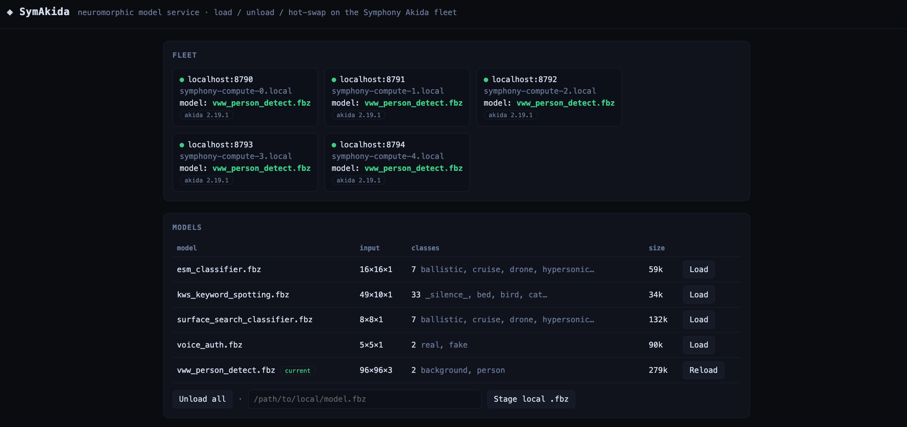
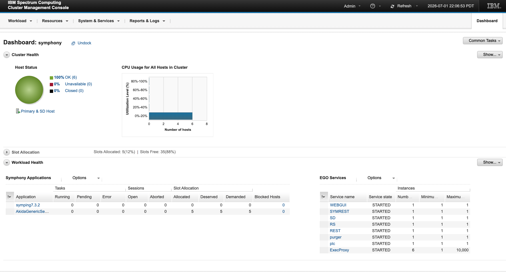
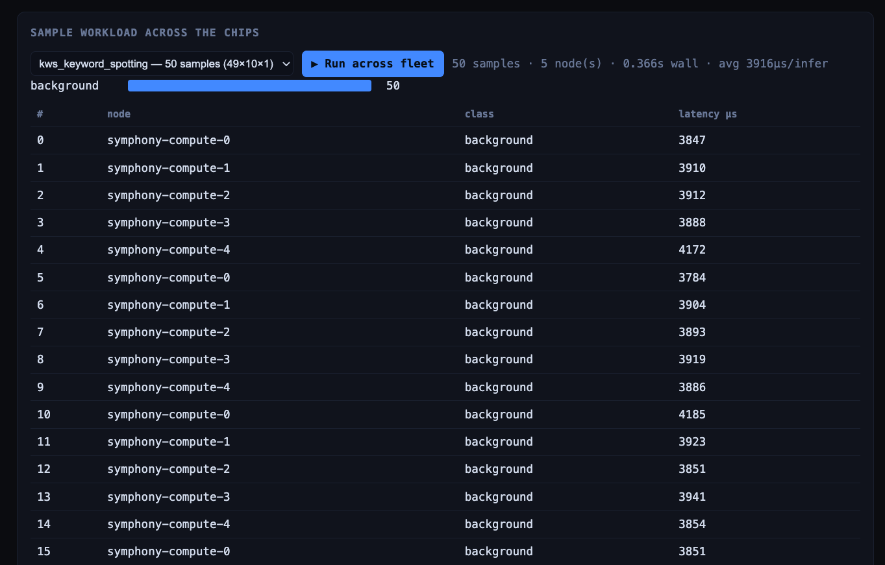

# Quickstart — install & run the demo

Stand up a **Symphony + Akida** cluster in Docker and drive it from a laptop
dashboard in about 10 minutes. This is the friendly walkthrough — for the full
reference (HTTP API, first-boot internals, build-from-source) see
**[BRAINCHIP-DEMO.md](BRAINCHIP-DEMO.md)**.

<p align="center">
  
  <br><em>The dashboard: live fleet, model load/hot-swap, and a workload fanned across the chips.</em>
</p>

---

## What you'll end up with

- **1 master + one compute container per Akida chip** running the model service.
- A **management console** and a **laptop dashboard** you drive from a browser.
- A demo that **loads a model and runs a sample workload across the fleet** —
  showing per-node latency as the workload round-robins across every live chip.

---

## Step 1 · Install

**You need:** Docker 20.10+ on Linux, ~8 GB free RAM, and `git-lfs`.

<details>
<summary><b>Get <code>git-lfs</code></b> (needed to clone the models & samples)</summary>

```bash
sudo apt-get install -y git-lfs   # or: brew install git-lfs
git lfs install
```
Without it, the `.fbz`/`.json` files clone as tiny pointer stubs.
</details>

Pull the image from GHCR and give it the short name the run commands use:

```bash
docker pull ghcr.io/brainchip-inc/symphony-akida:7.3.4
docker tag  ghcr.io/brainchip-inc/symphony-akida:7.3.4 symphonyce:7.3.4
```

Clone this repo (for the dashboard, models, and samples):

```bash
git clone https://github.com/Brainchip-Inc/symphony-akida.git
cd symphony-akida
```

---

## Step 2 · Start the cluster

Run this on its own first — it needs your `sudo` password interactively. If you
paste it as part of a bigger block, the password prompt can eat the commands
that follow, which silently skips the `mkdir`/`chown` and can look exactly like
the "all nodes down" failure in Troubleshooting below.

```bash
sudo mkdir -p /opt/symphony/shared && sudo chown 1000:1000 /opt/symphony/shared
```

Now the network and containers:

```bash
docker network create --driver bridge --subnet 172.30.0.0/24 symcluster1

# master — publishes the console (8443) and SSH (2222)
docker run -d --privileged --network symcluster1 \
    --hostname symphony-master.local --name symphony-master \
    --network-alias symphony-master.local \
    -p 8443:8443 -p 2222:22 \
    -e HOST_ROLE=MANAGEMENT \
    -e SSH_PUBLIC_KEY="$(cat ~/.ssh/id_rsa.pub)" \
    -v /opt/symphony/shared:/shared \
    symphonyce:7.3.4

# One compute container per Akida chip — DETECTED, not hardcoded, so the same
# block works whether the box has 1, 2, 5, or 8 chips. Each host /dev/akida<i>
# is passed into its container as /dev/akida0 and published on host port 8790+i
# (compute-0 -> 8790, compute-1 -> 8791, …). --privileged IS required here too,
# even though only --device is strictly needed for chip access: Symphony's PEM
# needs elevated privileges to manage the service instance's container/cgroup
# priority, and without it every node fails to start and the dashboard shows all
# nodes down (see Troubleshooting).
mapfile -t AKIDA_DEVS < <(ls -d /dev/akida* 2>/dev/null | sort -V)
N=${#AKIDA_DEVS[@]}
echo "Detected $N Akida chip(s): ${AKIDA_DEVS[*]:-none}"

for i in "${!AKIDA_DEVS[@]}"; do
  docker run -d --privileged --network symcluster1 \
    --hostname symphony-compute-$i.local --name symphony-compute-$i \
    --network-alias symphony-compute-$i.local \
    -p $((8790+i)):8790 --device=${AKIDA_DEVS[$i]}:/dev/akida0 \
    -e HOST_ROLE=COMPUTE \
    -v /opt/symphony/shared:/shared \
    symphonyce:7.3.4
done

# stage the 2 extra demo models this fork adds — ready-made .fbz, no
# conversion needed, just drop them where the service looks:
mkdir -p /opt/symphony/shared/models
cp .models/*.fbz .models/*_meta.json /opt/symphony/shared/models/
```

> **First boot takes a few minutes.** The cluster initialises, seeds the demo
> models, and registers the Akida service. The console needs **~3–6 min** to
> first paint — a blank `8443` early on is normal.
>
> **Re-running?** If you've launched this cluster before, wipe `/shared` first
> (`sudo rm -rf /opt/symphony/shared` then recreate it) — a leftover `ego.conf`
> puts the master into a broken recovery state where every node reads *down*.

<details>
<summary>No Akida hardware? Run on the software backend instead</summary>

Drop the `--device=…` flag (keep `--privileged`); inference runs on the Akida
**software backend** instead of real silicon. There are no `/dev/akida*` to
detect here, so pick a node count yourself (`COUNT` below) — it drives both the
container loop and the dashboard:

```bash
COUNT=3
for i in $(seq 0 $((COUNT-1))); do
  docker run -d --privileged --network symcluster1 \
    --hostname symphony-compute-$i.local --name symphony-compute-$i \
    --network-alias symphony-compute-$i.local \
    -p $((8790+i)):8790 -e HOST_ROLE=COMPUTE \
    -v /opt/symphony/shared:/shared \
    symphonyce:7.3.4
done
```
Then launch the dashboard (Step 3) with `AKIDA_NODE_COUNT=$COUNT`, and in the
"spread across every chip" step below use `N=$COUNT` instead of the `/dev/akida*`
count.
</details>

### Spread the service across every chip

Right after first boot the Akida service comes up on **one** compute node only —
it auto-registers before the others finish joining and, being a "preStart"
instance, doesn't rebalance on its own. Two shipped defaults also cap the
spread: the service profile hardcodes `numOfSlotsForPreloadedServices="3"` (so
with 4+ chips only 3 ever get an instance), and the resource plan's
`ComputeHosts` distribution policy ships **empty** (so Symphony stacks every
instance on the first host instead of 1-per-chip).

Fix both in one shot, **sized to your chip count** — the same command spreads
onto 1, 2, 5, or 8 chips. Run it once the console is up and
`docker exec symphony-master bash -lc 'source /opt/ibm/spectrumcomputing/profile.platform; egosh resource list'`
shows every compute node `ok` (≈ first boot + a minute). `N` is just the
`/dev/akida*` count, same as Step 2:

```bash
N=$(ls -d /dev/akida* 2>/dev/null | wc -l)   # chips = compute nodes
docker exec -e N="$N" symphony-master bash -lc '
  source /opt/ibm/spectrumcomputing/profile.platform
  egosh user logon -u Admin -x Admin
  echo Y | soamcontrol app disable AkidaGenericService; sleep 5
  # 1) one service slot per chip (profile default caps at 3)
  sed -i "s/numOfSlotsForPreloadedServices=\"[0-9]*\"/numOfSlotsForPreloadedServices=\"$N\"/" \
    /opt/akida-service/AkidaGenericService.xml
  soamreg /opt/akida-service/AkidaGenericService.xml -f
  # 2) place 1-per-host instead of stacking on the first host
  sed -i "/<ResourceGroupName>ComputeHosts<\/ResourceGroupName>/,+2 s#<PolicyParameter ParameterName=.DistributeBy./>#<PolicyParameter ParameterName=\"DistributeBy\">EqualFreeSlot</PolicyParameter>#" \
    /shared/kernel/conf/ConsumerTrees.xml
  egosh consumer applyresplan -f /shared/kernel/conf/ConsumerTrees.xml
  echo Y | soamcontrol app enable AkidaGenericService'
# every chip's port (8790, 8791, …) should serve within ~30-60s
```

Single-node (just `8790`) works out of the box without any of this — you only
need it to light up the rest of the fleet.

<details>
<summary>Still stacked on one host afterwards? Kill leftover workers and retry</summary>

```bash
docker ps -a --filter name=symphony-compute --format '{{.Names}}' | while read c; do
  docker exec "$c" bash -lc 'pkill -9 -f akida_worker.py; pkill -9 -f AkidaServiceContainer.py' 2>/dev/null
done
docker exec symphony-master bash -lc '
  source /opt/ibm/spectrumcomputing/profile.platform
  egosh user logon -u Admin -x Admin
  echo Y | soamcontrol app disable AkidaGenericService; sleep 10
  echo Y | soamcontrol app enable  AkidaGenericService'
```
Full detail in
[BRAINCHIP-DEMO.md](BRAINCHIP-DEMO.md#known-issues--expected-first-boot-behavior).
</details>

---

## Step 3 · Open it in the browser

| Open this | URL | Login |
|---|---|---|
| **Dashboard** (start here) | `http://localhost:5001` | — |
| Akida service (per node) | `http://localhost:8790`, `8791`, … (one per chip: `8790 + index`) | — |
| Management console (PMC) | `https://localhost:8443/platform` | `Admin` / `Admin` |

> The console's cert is self-signed, so your browser will show a security
> warning first — click through it (Chrome: "Advanced" → "Proceed to
> localhost (unsafe)"; Firefox: "Advanced" → "Accept the Risk and
> Continue"). **Open it in a real browser, not VS Code's Simple Browser** —
> Simple Browser has no click-through for untrusted certs and just fails
> with `ERR_CONNECTION_REFUSED` instead of showing the warning.

<p align="center">
  
  <br><em>PMC dashboard: 6/6 hosts OK (1 master + 5 compute), AkidaGenericService allocated 5/5 slots.</em>
</p>

Launch the dashboard **from the repo root** — the dashboard is `app.py` at the
root, next to `akida_client.py` (running `web/app.py` fails to import it):

```bash
python3 -m venv .venv && ./.venv/bin/pip install flask
# AKIDA_NODE_COUNT = number of chips; the dashboard builds one URL per node
# (localhost:8790, 8791, …) so this matches whatever Step 2 launched.
AKIDA_NODE_COUNT=$(ls -d /dev/akida* 2>/dev/null | wc -l) \
FLASK_PORT=5001 ./.venv/bin/python app.py
# then open http://localhost:5001
```

`AKIDA_NODE_COUNT` sizes the fleet to your chips automatically (ports start at
`AKIDA_PORT_BASE`, default `8790`); the dashboard then probes each and shows
which are live. Need non-default ports or hosts? Set `AKIDA_NODES` to an explicit
comma-separated URL list instead — it overrides the count. (Software-backend
run with no `/dev/akida*`? Pass the count you chose, e.g. `AKIDA_NODE_COUNT=3`.)

**What you should see:** the **Fleet** panel lists your live compute nodes as
green dots with hostname and akida SDK version (red/"down" for any that
aren't serving). The **Models** panel shows 5 `.fbz` models — 3 baked into
the image (`surface_search_classifier`, `voice_auth`, `esm_classifier`) plus
the 2 this fork adds (`kws_keyword_spotting`, `vww_person_detect`), staged
in Step 2.

> Inference on this image always runs on the akida **software backend**
> (`Model.forward()`) — device passthrough gets the container access to the
> physical chip, but the current worker only maps a throwaway copy to a
> virtual AKD1500 as a "this model fits on Akida silicon" proof, it never
> runs `forward()` on the real device. There's no on-chip-vs-software
> indicator in this dashboard (`app.py`) to reflect that — a fancier version
> with that badge exists in `web/app.py`, but it expects response fields the
> current service never sends, so don't rely on it either.

---

## Step 4 · Run the demo

1. In **Models**, click **Load** on any of the 3 models with a bundled sample
   dataset: `surface_search_classifier`, `kws_keyword_spotting`, or
   `vww_person_detect` (`voice_auth` and `esm_classifier` don't have a
   matching dataset under [`samples/`](samples/), so skip those for this step).
2. Pick the matching dataset in **Sample workload across the chips**, then
   click **▶ Run across fleet**.

**What you should see:** a results table fills in — one row per sample, showing
the **node** it ran on, the predicted **class**, and the **latency (µs)**.
That's the workload round-robining across every live chip. 🎉

<p align="center">
  
  <br><em>50 samples fanned across all 5 nodes, ~0.37s wall clock, ~3.9ms/inference.</em>
</p>

> The dataset dropdown resets to its first entry a few seconds after any
> run (it's rebuilt every 5s poll) — the results table and histogram don't
> change, only the dropdown's displayed selection. If you're comparing the
> two, trust the results table, not what the dropdown currently shows.

<details>
<summary>Prefer the command line?</summary>

```bash
curl localhost:8791/models                                    # list staged .fbz
curl -XPOST localhost:8791/load -d '{"name":"voice_auth"}'    # load on this node
curl localhost:8791/health                                    # current model
curl -XPOST localhost:8791/infer -d '{"input":[7,7,7,7,7,7,7,7,7,7,7,7,7,7,7,7,7,7,7,7,7,7,7,7,7]}'
```
Endpoints: `GET /health`, `GET /models`, `POST /load|/reload|/unload|/infer`.
</details>

---

## Troubleshooting

<details open>
<summary><b>Dashboard loads but every node shows <b>down</b>, even on a fresh cluster</b></summary>

**Check this first, before anything else:** is `symphony-master` actually
running?

```bash
docker ps -a --filter name=symphony-master --filter name=symphony-compute
```

If `symphony-master` isn't in the list (only compute containers are), that's
the whole problem — every compute node waits forever for a master that
doesn't exist (`docker logs symphony-compute-0` will end on `waiting for
master shared ego.conf...` and never move past it). Run the master command
from [Step 2](#step-2--start-the-cluster) — easy to lose track of if you
tore the cluster down and relaunched only part of it:

```bash
docker run -d --privileged --network symcluster1 \
    --hostname symphony-master.local --name symphony-master \
    --network-alias symphony-master.local \
    -p 8443:8443 -p 2222:22 \
    -e HOST_ROLE=MANAGEMENT \
    -e SSH_PUBLIC_KEY="$(cat ~/.ssh/id_rsa.pub)" \
    -v /opt/symphony/shared:/shared \
    symphonyce:7.3.4
```
Existing compute containers will join it on their own within a few seconds —
no need to recreate them too.

If `symphony-master` **is** running and it's still all-down, it's almost
always a missing `--privileged` on the compute containers instead. Symphony's
PEM needs it to manage the service instance's container priority; without it,
every attempt to start the Akida service fails on every host and the host
gets blocked after 3 tries. Confirm with:

```bash
docker exec symphony-master grep -m1 "Failed to set container priority" \
  /opt/ibm/spectrumcomputing/soam/logs/ssm.symphony-master.local.AkidaGenericService.log
```
If that prints a match, re-launch the compute containers with `--privileged`
added (as in [Step 2](#step-2--start-the-cluster) above):

```bash
docker ps -a --filter name=symphony-compute --format '{{.Names}}' | xargs -r docker rm -f
mapfile -t AKIDA_DEVS < <(ls -d /dev/akida* 2>/dev/null | sort -V)
for i in "${!AKIDA_DEVS[@]}"; do
  docker run -d --privileged --network symcluster1 \
    --hostname symphony-compute-$i.local --name symphony-compute-$i \
    --network-alias symphony-compute-$i.local \
    -p $((8790+i)):8790 --device=${AKIDA_DEVS[$i]}:/dev/akida0 \
    -e HOST_ROLE=COMPUTE \
    -v /opt/symphony/shared:/shared \
    symphonyce:7.3.4
done
docker exec symphony-master bash -lc '
  source /opt/ibm/spectrumcomputing/profile.platform
  egosh user logon -u Admin -x Admin
  echo Y | soamcontrol app disable AkidaGenericService; sleep 5
  echo Y | soamcontrol app enable  AkidaGenericService'
```
Then check the "only one node serving" and "more than 3 chips" entries below —
you'll likely need those too, to actually get every chip serving at once.
</details>

<details>
<summary><code>Error response from daemon: network with name symcluster1 already exists</code></summary>

The network is left over from a previous run. Easiest fix: **skip the
`docker network create` line** and carry on — the `docker run` commands attach to
the existing `symcluster1` by name.

To recreate it clean instead, remove the old cluster first (the network won't
delete while containers are attached), then re-run the create:

```bash
docker ps -a --filter name=symphony --format '{{.Names}}' | xargs -r docker rm -f
docker network rm symcluster1
docker network create --driver bridge --subnet 172.30.0.0/24 symcluster1
```
</details>

<details>
<summary><code>The container name "/symphony-master" is already in use</code></summary>

Same cause — containers from a previous run are still around. Remove them, then
re-run the launch block from Step 2:

```bash
docker ps -a --filter name=symphony --format '{{.Names}}' | xargs -r docker rm -f
```
</details>

<details>
<summary>All nodes show <b>down</b> / master log says <code>no valid hosts in EGO_MASTER_LIST</code></summary>

The cluster booted against a **stale `/shared`** from a previous run, so the
master took the recovery path with a mismatched host list — EGO never starts and
no node serves. Confirm with `docker logs symphony-master | grep -i recovery`
(you'll see `master recovery: shared state present`).

Fix: tear down, **wipe `/shared`**, and relaunch from scratch (the network can stay):

```bash
docker ps -a --filter name=symphony --format '{{.Names}}' | xargs -r docker rm -f
sudo rm -rf /opt/symphony/shared
sudo mkdir -p /opt/symphony/shared && sudo chown 1000:1000 /opt/symphony/shared
```
Then re-run the master + compute blocks from [Step 2](#step-2--start-the-cluster).
Always relaunch a cluster from an **empty `/shared`**.
</details>

<details>
<summary><code>ModuleNotFoundError: No module named 'akida_client'</code></summary>

You ran `web/app.py`. In this repo the dashboard is **`app.py` at the repo root**,
sitting next to `akida_client.py` — run that instead, from the repo root:

```bash
AKIDA_NODES="http://localhost:8790,http://localhost:8791" \
FLASK_PORT=5001 ./.venv/bin/python app.py
```
</details>

<details>
<summary>Console (<code>8443</code>) is blank or refuses to connect</summary>

Normal for the first **~3–6 min** after boot — Liberty is slow to start on the
bundled JRE. Give it time before assuming something's wrong.
</details>

More detail (single-node service on first boot, fresh-`/shared` requirement) is
in [BRAINCHIP-DEMO.md](BRAINCHIP-DEMO.md#known-issues--expected-first-boot-behavior).

---

## Done? Tear it down

<details>
<summary>Stop and remove everything</summary>

```bash
# removes the master + every compute container, whatever the chip count
docker ps -a --filter name=symphony --format '{{.Names}}' | xargs -r docker rm -f
docker network rm symcluster1
# for a clean restart, also wipe /opt/symphony/shared before relaunching the master
```
</details>

---

<sub>Something not behaving? The **Known issues & expected first-boot behavior**
section of [BRAINCHIP-DEMO.md](BRAINCHIP-DEMO.md) covers the slow console, the
single-node service, and the fresh-`/shared` requirement.</sub>
