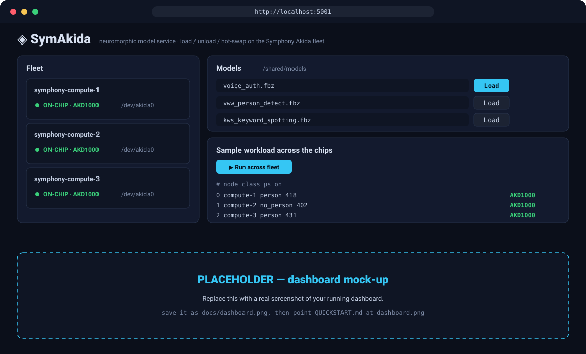

# Quickstart — install & run the demo

Stand up a **Symphony + Akida** cluster in Docker and drive it from a laptop
dashboard in about 10 minutes. This is the friendly walkthrough — for the full
reference (HTTP API, first-boot internals, build-from-source) see
**[BRAINCHIP-DEMO.md](BRAINCHIP-DEMO.md)**.

<p align="center">
  
  <br><em>The dashboard: live fleet, model load/hot-swap, and a workload fanned across the chips.</em>
</p>

---

## What you'll end up with

- **1 master + one compute container per Akida chip** running the model service.
- A **management console** and a **laptop dashboard** you drive from a browser.
- A demo that **loads a model and runs a sample workload across the fleet** —
  showing per-node latency and whether each ran **on-chip (AKD1000)** or in software.

---

## Step 1 · Install

**You need:** Docker 20.10+ on Linux, ~8 GB free RAM, and `git-lfs`.

<details>
<summary><b>Get <code>git-lfs</code></b> (needed to clone the models & samples)</summary>

```bash
sudo apt-get install -y git-lfs   # or: brew install git-lfs
git lfs install
```
Without it, the `.h5`/`.json` files clone as tiny pointer stubs.
</details>

Pull the image from GHCR and give it the short name the run commands use:

```bash
docker pull ghcr.io/brainchip-inc/symphony-akida:7.3.4
docker tag  ghcr.io/brainchip-inc/symphony-akida:7.3.4 symphonyce:7.3.4
```

Clone this repo (for the dashboard, models, and samples):

```bash
git clone https://github.com/Brainchip-Inc/symphony-akida.git
cd symphony-akida
```

---

## Step 2 · Start the cluster

```bash
docker network create --driver bridge --subnet 172.30.0.0/24 symcluster1
sudo mkdir -p /opt/symphony/shared && sudo chown 1000:1000 /opt/symphony/shared

# master — publishes the console (8443) and SSH (2222)
docker run -d --privileged --network symcluster1 \
    --hostname symphony-master.local --name symphony-master \
    --network-alias symphony-master.local \
    -p 8443:8443 -p 2222:22 \
    -e HOST_ROLE=MANAGEMENT \
    -e SSH_PUBLIC_KEY="$(cat ~/.ssh/id_rsa.pub)" \
    -v /opt/symphony/shared:/shared \
    symphonyce:7.3.4

# one compute container per Akida chip — here 5, on /dev/akida0–4 (HTTP on 8790–8794).
# Each chip is passed in as the container's /dev/akida0; no --privileged needed.
# Adjust the list to your chip count, e.g. `for n in 0 1 2` for three.
for n in 0 1 2 3 4; do
  docker run -d --network symcluster1 \
    --hostname symphony-compute-$n.local --name symphony-compute-$n \
    --network-alias symphony-compute-$n.local \
    -p 879$n:8790 --device=/dev/akida$n:/dev/akida0 \
    -e HOST_ROLE=COMPUTE \
    -v /opt/symphony/shared:/shared \
    symphonyce:7.3.4
done
```

> **First boot takes a few minutes.** The cluster initialises, seeds the demo
> models, and registers the Akida service. The console needs **~3–6 min** to
> first paint — a blank `8443` early on is normal.
>
> **Re-running?** If you've launched this cluster before, wipe `/shared` first
> (`sudo rm -rf /opt/symphony/shared` then recreate it) — a leftover `ego.conf`
> puts the master into a broken recovery state where every node reads *down*.

<details>
<summary>No Akida hardware? Run on the software backend instead</summary>

Drop the `--device=…` flag and add `--privileged`; inference runs on the Akida
**software backend** and the dashboard labels each node **SOFTWARE (CPU)**. Chip
count no longer applies — pick any number of nodes:

```bash
for n in 0 1 2; do
  docker run -d --privileged --network symcluster1 \
    --hostname symphony-compute-$n.local --name symphony-compute-$n \
    --network-alias symphony-compute-$n.local \
    -p 879$n:8790 -e HOST_ROLE=COMPUTE \
    -v /opt/symphony/shared:/shared \
    symphonyce:7.3.4
done
```
</details>

<details>
<summary>Only one node serving? (expected on first boot) — spread across all chips</summary>

The service comes up on the first compute node that joins and doesn't rebalance
on its own. Once `egosh resource list` shows every node `ok`, one re-enable
spreads it 1-per-host:

```bash
docker exec symphony-master bash -lc '
  source /opt/ibm/spectrumcomputing/profile.platform
  egosh user logon -u Admin -x Admin
  echo Y | soamcontrol app disable AkidaGenericService; sleep 30
  echo Y | soamcontrol app enable  AkidaGenericService'
# then every node's port (8790, 8791, … 8794) serves (SIs take ~1–2 min to spawn)
```
The first node works out of the box without this. Full detail in
[BRAINCHIP-DEMO.md](BRAINCHIP-DEMO.md#known-issues--expected-first-boot-behavior).
</details>

---

## Step 3 · Open it in the browser

| Open this | URL | Login |
|---|---|---|
| **Dashboard** (start here) | `http://localhost:5001` | — |
| Akida service (per node) | `http://localhost:8790` … `8794` (one per chip) | — |
| Management console (PMC) | `https://localhost:8443/platform` | `Admin` / `Admin` |

Launch the dashboard **from the repo root** — the dashboard is `app.py` at the
root, next to `akida_client.py` (running `web/app.py` fails to import it):

```bash
python3 -m venv .venv && ./.venv/bin/pip install flask
AKIDA_NODES="http://localhost:8790,http://localhost:8791,http://localhost:8792,http://localhost:8793,http://localhost:8794" \
FLASK_PORT=5001 ./.venv/bin/python app.py
# then open http://localhost:5001
```

`AKIDA_NODES` is one URL per compute node — trim or extend the list to match how
many you launched; the dashboard auto-detects which are live.

**What you should see:** the **Fleet** panel lists your live compute nodes,
each with a green **● ON-CHIP · AKD1000** badge (or **SOFTWARE (CPU)** without
hardware). The **Models** panel shows the seeded demo `.fbz` models.

---

## Step 4 · Run the demo

1. In **Models**, click **Load** on a model (e.g. `vww_person_detect`).
2. In **Sample workload across the chips**, click **▶ Run across fleet**.

**What you should see:** a results table fills in — one row per sample, showing
the **node** it ran on, the predicted **class**, the **latency (µs)**, and an
**AKD1000** (green) or **CPU** tag per row. That's the workload round-robining
across every live chip. 🎉

<details>
<summary>Prefer the command line?</summary>

```bash
curl localhost:8791/models                                    # list staged .fbz
curl -XPOST localhost:8791/load -d '{"name":"voice_auth"}'    # load on this node
curl localhost:8791/health                                    # current model
curl -XPOST localhost:8791/infer -d '{"input":[7,7,7,7,7,7,7,7,7,7,7,7,7,7,7,7,7,7,7,7,7,7,7,7,7]}'
```
Endpoints: `GET /health`, `GET /models`, `POST /load|/reload|/unload|/infer`.
</details>

---

## Troubleshooting

<details>
<summary><code>Error response from daemon: network with name symcluster1 already exists</code></summary>

The network is left over from a previous run. Easiest fix: **skip the
`docker network create` line** and carry on — the `docker run` commands attach to
the existing `symcluster1` by name.

To recreate it clean instead, remove the old cluster first (the network won't
delete while containers are attached), then re-run the create:

```bash
for c in symphony-compute-3 symphony-compute-2 symphony-compute-1 symphony-master; do docker rm -f $c 2>/dev/null; done
docker network rm symcluster1
docker network create --driver bridge --subnet 172.30.0.0/24 symcluster1
```
</details>

<details>
<summary><code>The container name "/symphony-master" is already in use</code></summary>

Same cause — containers from a previous run are still around. Remove them, then
re-run the launch block from Step 2:

```bash
for c in symphony-compute-3 symphony-compute-2 symphony-compute-1 symphony-master; do docker rm -f $c 2>/dev/null; done
```
</details>

<details>
<summary>All nodes show <b>down</b> / master log says <code>no valid hosts in EGO_MASTER_LIST</code></summary>

The cluster booted against a **stale `/shared`** from a previous run, so the
master took the recovery path with a mismatched host list — EGO never starts and
no node serves. Confirm with `docker logs symphony-master | grep -i recovery`
(you'll see `master recovery: shared state present`).

Fix: tear down, **wipe `/shared`**, and relaunch from scratch (the network can stay):

```bash
for c in symphony-compute-4 symphony-compute-3 symphony-compute-2 symphony-compute-1 symphony-compute-0 symphony-master; do docker rm -f $c; done
sudo rm -rf /opt/symphony/shared
sudo mkdir -p /opt/symphony/shared && sudo chown 1000:1000 /opt/symphony/shared
```
Then re-run the master + compute blocks from [Step 2](#step-2--start-the-cluster).
Always relaunch a cluster from an **empty `/shared`**.
</details>

<details>
<summary><code>ModuleNotFoundError: No module named 'akida_client'</code></summary>

You ran `web/app.py`. In this repo the dashboard is **`app.py` at the repo root**,
sitting next to `akida_client.py` — run that instead, from the repo root:

```bash
AKIDA_NODES="http://localhost:8790,http://localhost:8791" \
FLASK_PORT=5001 ./.venv/bin/python app.py
```
</details>

<details>
<summary>Console (<code>8443</code>) is blank or refuses to connect</summary>

Normal for the first **~3–6 min** after boot — Liberty is slow to start on the
bundled JRE. Give it time before assuming something's wrong.
</details>

More detail (single-node service on first boot, fresh-`/shared` requirement) is
in [BRAINCHIP-DEMO.md](BRAINCHIP-DEMO.md#known-issues--expected-first-boot-behavior).

---

## Done? Tear it down

<details>
<summary>Stop and remove everything</summary>

```bash
for c in symphony-compute-3 symphony-compute-2 symphony-compute-1 symphony-master; do
  docker rm -f $c
done
docker network rm symcluster1
# for a clean restart, also wipe /opt/symphony/shared before relaunching the master
```
</details>

---

<sub>Something not behaving? The **Known issues & expected first-boot behavior**
section of [BRAINCHIP-DEMO.md](BRAINCHIP-DEMO.md) covers the slow console, the
single-node service, and the fresh-`/shared` requirement.</sub>
