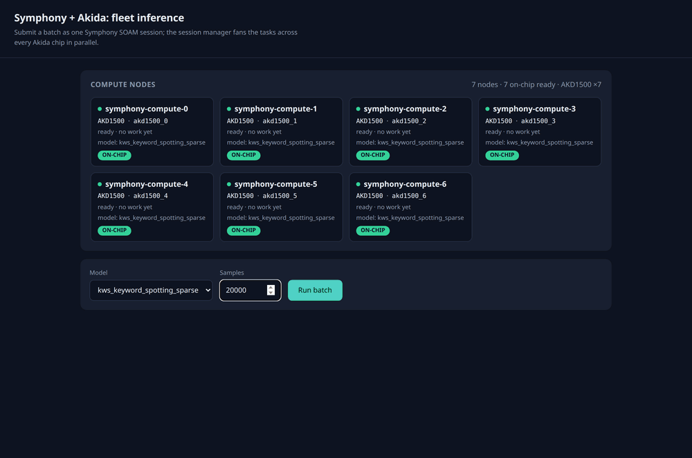
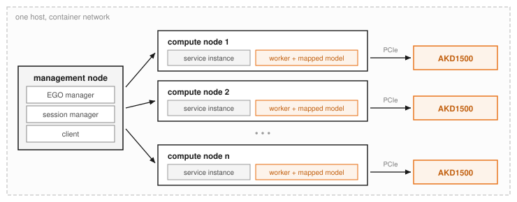

<p align="center">
  <picture>
    <source media="(prefers-color-scheme: dark)" srcset="docs/assets/brainchip-logo-dark.svg">
    
  </picture>
</p>

<p align="center">
  
  
  
  
  
  
</p>

<p align="center">
  <a href="https://developer.brainchip.com/signup/"></a>
  <a href="https://discord.com/invite/9bmd9g52vn"></a>
  <a href="https://shop.brainchipinc.com/collections/all?sort_by=best-selling"></a>
</p>

# Symphony + Akida: on-chip fleet inference

<p align="center">
  <a href="#the-three-apps">Apps</a> ·
  <a href="#how-it-runs">How it runs</a> ·
  <a href="#quickstart">Quickstart</a> ·
  <a href="#get-the-hardware">Hardware</a> ·
  <a href="#community-and-support">Community</a> ·
  <a href="#license">License</a>
</p>

Distribute AI inference across a fleet of **BrainChip Akida** neuromorphic processors,
scheduled as ordinary cluster resources by **IBM Spectrum Symphony** (Community Edition).
One management node plus one compute node per chip; each node maps its model onto its own
silicon and runs inference **on-chip**. Three demo apps ship in one
image and share one cluster, so you can run them back to back and watch the same hardware
behave differently.

> **This needs Akida hardware on the host.** There is no simulator path: a node with no
> mappable Akida device is never given work, by design.

Announced on the [BrainChip Developer Hub](https://developer.brainchip.com/symphony-community-akida-bundle/).

<p align="center">
  
  <br>
  <sub>All three apps on the reference fleet: the concurrent SOAM fan-out, the serial
  round-robin baseline, the six-chip shard pipeline, and the same fan-out driven from the
  command-line client.</sub>
</p>

## The three apps

All three build from the same image (`symphony-akida`) and the same cluster. The launcher
activates exactly one at a time; they never run in parallel.

| App | What it shows | On the reference fleet |
|---|---|---|
| **batch-inference** | One Symphony SOAM session fanned concurrently across every chip | every chip busy at once |
| **serial-http-round-robin** | The deliberate "before" baseline: plain HTTP, one request at a time | roughly one chip busy at any moment |
| **image-shard-inference** | One 448 frame split into six tiles, one per chip, merged back into one result | 49.14 mAP50 on the VOC2007 test split, six chips in parallel |

### batch-inference

Submit a batch as a single SOAM session. Symphony's session manager distributes the tasks
across every chip in the fleet, and the dashboard shows the per-chip split and the
throughput. How much a fleet buys you depends on the model: keyword spotting is 0.25 ms
on-chip, so dispatch overhead dominates and the gain is modest. Image sharding puts 76 ms
of work on each chip and scales far better.

[Full guide](src/apps/batch-inference/README.md)

### serial-http-round-robin

The contrast case. A plain HTTP inference server on each chip, and a dashboard that
dispatches one request at a time, round-robin. The fleet is the same; only the dispatch
changed.

[Full guide](src/apps/serial-http-round-robin/README.md)

### image-shard-inference

Not a throughput trick. A 448 YOLOv2 cannot map to AKD1500 at all, so one frame is split
into six 224 tiles, inferred in parallel on six chips through three SOAM services, and
merged. That is worth **+8.6 mAP50** over the best single-device option, and the repo
ships the test kit that proves it.

[Full guide](src/apps/image-shard-inference/README.md)

## How it runs

An Akida device is treated as an ordinary cluster resource: a compute node owns it, and a
service instance is bound to it. Everything runs in containers on **one host**. The
management node runs the EGO manager, the session manager and the client; each compute node
owns exactly **one Akida device over PCIe** and hosts one service instance mapped to it.

<p align="center">
  <picture>
    <source media="(prefers-color-scheme: dark)" srcset="docs/assets/fleet-topology-dark.svg">
    
  </picture>
</p>

Three consequences worth knowing before you launch:

- **Community Edition caps the cluster at 64 cores**, which is one master plus seven
  compute nodes. On an eight-chip host the eighth chip idles, and the launcher says so.
- **On-chip only.** Each service instance maps its model onto its own chip. A node whose
  chip will not take the model does not become available for work.
- **Six chips for the shard demo**, one per tile of a 448 frame. The sixth tile is the
  whole frame downscaled, and dropping it costs more accuracy than dropping the other five.

<details>
<summary><b>Reference system</b></summary>

Every number in this repository was measured on this machine.

| | |
|---|---|
| Host | Intel Core i7-11700B, 8 cores / 16 threads, 30 GB RAM |
| OS | Ubuntu 24.04 LTS, kernel 6.17 |
| PCIe fabric | PLX **PEX 8749**, 48-lane 18-port PCIe Gen 3 multi-root switch |
| Accelerators | **8 x [AKD1500 M.2](https://shop.brainchipinc.com/products/akd1500-m-2-card-b-m-key)** behind that switch, plus 3 x AKD1000 PCIe boards |
| Driver | out-of-tree `akida_pcie` kernel module |

The switch is what makes the fleet interesting: eight M.2 cards on a single x86 host, each
enumerating as its own PCIe endpoint (`/dev/akd1500_0` through `/dev/akd1500_7`), so
Symphony can hand each one to a different compute node.

Both device families work. The apps read the device off the chip's own `HwVersion` rather
than assuming, so a mixed fleet reports itself honestly, and the launcher warns when it
selects an AKD1000.
</details>

## Prerequisites

- **Akida hardware** on the host, with the `akida_pcie` driver loaded, so that
  `/dev/akd1500_*` and/or `/dev/akida*` exist.
- **Docker.** Containers run privileged; there is no compose file and no Kubernetes.
- **Git LFS.** The models and sample sets are LFS objects, about 95 MB.
- **[uv](https://docs.astral.sh/uv/) and Python 3.10+** for the host-side dashboards.
- **Network access** to Docker Hub, PyPI and GitHub releases. No IBM credentials and no
  private registry are needed at any point.

## Quickstart

```bash
git clone https://github.com/Brainchip-Inc/symphony-akida.git && cd symphony-akida
git lfs install && git lfs pull                    # ~95 MB: models, anchors, sample sets
curl -LsSf https://astral.sh/uv/install.sh | sh    # host tooling for the dashboards
uv sync

docker build --build-arg ACCEPT_IBM_LICENSE=yes \
    -f docker/Dockerfile -t symphony-akida .       # bakes all three app backends

./scripts/launch/up.sh batch-inference             # auto-sizes to the healthy chips
uv run python src/apps/batch-inference/dashboard/app.py
```

Then open <http://localhost:5001>. Over SSH, forward it first:
`ssh -L 5001:localhost:5001 <user>@<host>`.

To switch demos, tear down and bring the other up:

```bash
./scripts/launch/down.sh
./scripts/launch/up.sh <batch-inference|serial-http-round-robin|image-shard-inference>
```

Both launchers document themselves. `up.sh --help` lists the apps, the `--nodes N|all`
flag and every environment override; `down.sh --help` explains what teardown removes.

The Symphony console is at `https://localhost:8443/platform` (`Admin` / `Admin`, behind a
self-signed certificate). Expect three to six minutes to first paint after a fresh boot.

<details>
<summary><b>Build notes</b></summary>

`ACCEPT_IBM_LICENSE=yes` is required and has no default. The image is built from IBM
Spectrum Symphony Community Edition, so you accept IBM's license yourself rather than this
repository doing it for you. Without the flag the build stops before anything is
downloaded and prints what it is asking you to agree to.

The first build pulls about 1.5 GB (IBM's Symphony CE image) plus 67 MB (CPython 3.12), so
it takes a while. Rebuilds are cached.

Sanity-check a fresh build before launching anything. It asserts every invariant the apps
depend on and names the exact one that broke:

```bash
docker run --rm --entrypoint /usr/local/bin/verify-image symphony-akida --full
```

The image pins **akida 2.19.2**. The tiled YOLOv2 checkpoint is serialized by it and
2.19.1 refuses to deserialize it, so rebuild after pulling a change that touches `docker/`.

Full detail, including why the image is built the way it is:
**[docs/image-build.md](docs/image-build.md)**.
</details>

<details>
<summary><b>Repository layout</b></summary>

```
docker/     Dockerfile (public sources only) + entrypoint + the patch / PKI / verify
            scripts it runs at build time; bakes all three app backends
scripts/    launch/  up.sh <app> [--nodes N|all] [--dataset <npz>] / down.sh, both --help
            plus reference verification and mAP scoring
models/     on-chip .fbz models + anchors (Git LFS)
data/       one folder per dataset, one .npz in each, all Git LFS (see data/README.md)
docs/       image-build.md and the images used by these READMEs
src/
  common/   shared code: akida_chip (on-chip core), tiled_shard (tile geometry, decode and
            merge), detection_map (mAP), testkit (VOC test kit reader), draw_detections,
            worker_io, models allowlist, sample prep
  apps/
    batch-inference/          SOAM service + client + dashboard (concurrent)
    serial-http-round-robin/  per-node HTTP server + client + dashboard (serial)
    image-shard-inference/    3 SOAM services (segment/inference/stitch) + client + dashboard
```

Everything the cluster writes at runtime lives under `.cluster/` in the repo, bind-mounted
to `/shared`. Nothing is written to `/opt`, and teardown never needs `sudo`.
</details>

## Get the hardware

These demos run on either Akida device family, and the apps read which one they are on
from the chip itself.

- **[AKD1500 M.2 card (B+M key)](https://shop.brainchipinc.com/products/akd1500-m-2-card-b-m-key)**, the part this fleet is built from.
- **[AKD1000 PCIe board](https://shop.brainchipinc.com/products/akida%E2%84%A2-development-kit-pcie-board)** and the **[AKD1000 M.2 card](https://shop.brainchipinc.com/products/m-2-card-m-key)**.

Both families are in the [BrainChip Shop](https://shop.brainchipinc.com/collections/all?sort_by=best-selling).

## Community and support

Hit a problem reproducing a demo, or anything else in this repository?
**[Open an issue](https://github.com/Brainchip-Inc/symphony-akida/issues)** and say what
you ran, what happened, and what your fleet looks like.

- [Sign up for the BrainChip Developer Hub](https://developer.brainchip.com/signup/) for tools, the model zoo and Akida Cloud
- [Join the BrainChip Discord](https://discord.com/invite/9bmd9g52vn) for discussion and community help
- [Read the documentation](https://doc.brainchipinc.com) for MetaTF and the Akida platform
- [Subscribe to the newsletter](https://brainchip.com/newsletter/) for releases and announcements
- [Get in touch with sales](https://brainchip.com/contact/) to talk about a deployment
- Follow BrainChip on [LinkedIn](https://www.linkedin.com/company/brainchip-holdings-limited) and [X](https://x.com/BrainChip_inc)

## License

This repository is licensed under the **Apache License 2.0**. See [LICENSE](LICENSE).

It contains no IBM or BrainChip proprietary binaries. `docker build` fetches them, and
they keep their own terms:

- **IBM Spectrum Symphony Community Edition 7.3.2** is pulled from IBM's public image
  [`ibmcom/spectrum-symphony`](https://hub.docker.com/r/ibmcom/spectrum-symphony/), pinned
  by digest, and licensed by IBM under IBM's terms. That is why `docker build` requires
  `--build-arg ACCEPT_IBM_LICENSE=yes`: you accept those terms yourself, and there is no
  default. The full text ships inside the built image at `/licenses`, and the Community
  Edition entitlement comes from IBM's own image, not from this repository.
- **BrainChip MetaTF (`akida`)** is installed from PyPI at build time under the
  [BrainChip Software End User License Agreement](https://doc.brainchipinc.com/license.html).

[NOTICE](NOTICE) carries the consolidated attributions, including the provenance and terms
of every dataset under `data/`.

## Contributing

This repository is maintained by BrainChip, and changes are made by the maintainer team.
Bug reports are very welcome as issues. See [CONTRIBUTING.md](CONTRIBUTING.md).
